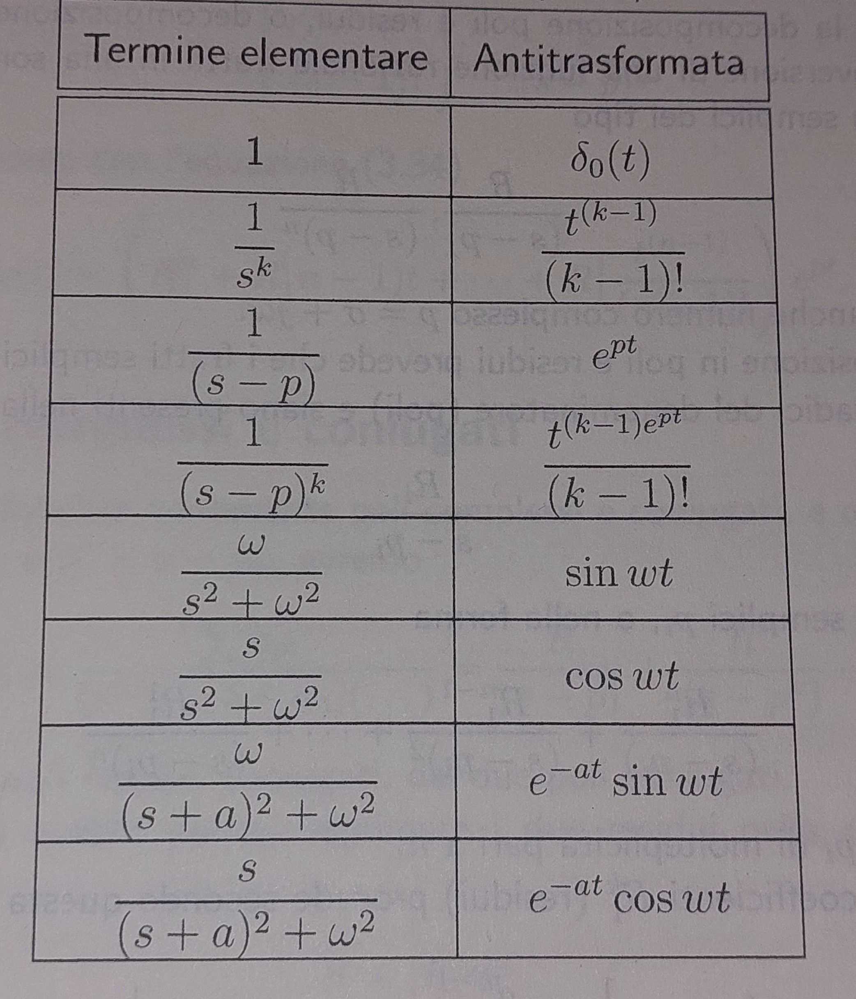

# ANTILAPLACE AND TRANSFER FUNCTION

## Why is Laplace transformation so useful?
All the stuf that we have learned about laplace become useful when we decide to deal with ODE.
The idea is that if we apply Laplace to our ODE we will change the formalization of our problem without losing its properties, it's like using a different pair of glasses.

let's imagine we have our generic lineary differential equation:

an* y(n) + a1* y' + a0* y = bm* u(m) + ... + b1* u' + b0* u

we can clearly do something like:

laplace( an* y(n) + a1* y' + a0* y ) = laplace( bm* u(m) + ... +b1* u' + b0* u )

now we should remember some of the property, the first is that laplace is linear so laplace(y + g) = laplace(y) + laplce(g), the second property is the one that says that laplace(y(n)(t)) = s^n* Y(s) + sum( s^i * y(n-1-i)(t = 0-) ) for that goes from n-1 to 0:

this means that our LDE can be write as:

an * s^n * Y(s) + sum(of stuff) + ... + a1 * s * Y(s) + sum(of stuff) + a0 * Y(s) + sum(stuff) = bm * s^n * U(s) + sum(of stuff) + ... + b1 * s * U(s) + sum(of stuff) + b0 * U(s) + sum(stuff)

now we collect all the sum of stuff to polish a little bit: 

an * s^n * Y(s) + ... + a1 * s * Y(s) + a0 * Y(s) + sum(of stuff) = bm * s^n * U(s) + ... + b1 * s * U(s) + b0 * U(s)

what's amazing of this is that we passed from a differential equation to a linear equation with product and addition. We can now called the Y(s) and U(s):

Y(s) * (an * s^n + ... + a1 * s + a0 )  = U(s) * (bm * s^n + ... + b1 * s + b0) - sum(of stuff)

now we can divide for the coefficient of Y(s) getting to this form:

Y(s) =( U(s) * (bm * s^n + ... + b1 * s + b0) - sum(of stuff) ) / (an * s^n + ... + a1 * s + a0 )

now if some how we can manage to calculate Y(s) we can simply do a stuff like:

laplace^-1(Y(s)) that will return exactly what we was searching y(t). That's why laplace is so powerful, we can use it to momentarly change perspective to the return to our initial problem but with a better understanding.

To do this we need to introduce some fancy stuff to calculate the antilaplace, after that we will analize better the formula that we have reached before.

## Antilaplace
laplace-1(F(s)) has a pretty complex formula that i encourage you to search beacuase i will write it down. But using that with some tricks we can find the antiplace for some useful F(s). The table below will gave us the tools that we will use in futere:

from the last two we can also obtain another useful formula, the once that has a trynom to the denominator and a polynom of first order to the numerator. the idea is pretty easy and consist in multypling the last two formulas of the table for some value b and c, and than sum them the result will be:

(bs + cs) / ((s+a)^2 + w^2) = (bs + cs) / (s^2 + 2as + a^2 + w^2)

the laplace-1 of this will return a function like:

e^at(bsin(wt)+c *cos(wt))

with a proper choose of a, b, c and w like:
2a = a1, b=b1, cw = b0, a^2 + w^2 = a0
We can write whatever situotion like this:

( b1s + b0s )/ (s^2 + a1s + a0)

Now the last tools we need is the decomposition in polys and residues. This is useful when ever we have a fraction that has a grater order on the denominator than the numerator (all our case when we analyze some causal situation).
The idea is that all this kind of fraction can be rewritten with this procedure:

First find the roots of the denominator, these can have multiplicity grater than 1.
than we can write the fraction as a sum of fraction that has as denominator (s-pi) and has denominator some ammount Ri. If multiplicity is grater than 1, let's say n, for that pole we can write it as sum(Ri^(n+1-k)/(s-pi)^k) where k goes from 1 to n.
Ri(k) is calcultare as: 1/(k-1)! * ((s-pi)^n * F(s))(k-1 (derivatives)) calculated in s = pi.

Now that we have this simple scomposition we can simply apply laplace and the result will be pretty easy if we take a look to the table. all the terms can be reconduct to that table making easy to us. This can also be applied to the case of complex coniugate solution, the difference is that after we found the solution we can juggle with the result to find the more visually satisfying result: y(t) = |R|e^σt* cos(wt + phi).

## Transfer Function
Now we can return to this formula: 

Y(s) =( U(s) * (bm * s^n + ... + b1 * s + b0) - sum(of stuff) ) / (an * s^n + ... + a1 * s + a0 )

and we can talk about it. First notice that the denominator of both part that respresent Y(s) are the characteristic polynom of the differential equation.
Notice also that is we set U(s) = 0, the first term of the equation will disappear, leaving us just the intial condition over the characteristic polynom, in this case we have just the root of this that will characterize totaly the system behavior. In general in this situation the root of this polynom will characterize always the behavior of our system. 
If the polynom allows to our system to be stable than with every input U(s) we can obtain a stable result, insted if the polynom doesn't garantee stability than there is nothing we can do with U(s).
Now let's call the second term of the equation free evolution because if U(s) = 0 that term will describe how the system will natuarally evolve no matter of initial condition. The first term will be instead the Forcing term.
Now if we have a condition where all initial conditions are 0 this will make our formula like this:

Y(s) =( U(s) * (bm * s^n + ... + b1 * s + b0) ) / (an * s^n + ... + a1 * s + a0 )

the antilaplace will be determined by the roots of the characterist polynom and the roots of U(s), we can say that is the roots of the characterist polynom will describe a converging system than the U(s) will be the only term to influence this stability, so the result will be similar to u(t) so the input function. If we have a stable system this will produce an output similar to our input function.

Now let's give an aspect to this so called Transfer Function. We define Transfer Functio the fraction:

F(s) = (bm * s^n + ... + b1 * s + b0) / (an * s^n + ... + a1 * s + a0 )

Even in this case the roots of the denominator coinced with the roots of the characterist polynom. We will call zeros of the function the value that will zero out the numarator. 
We can now describe the Y(s) = F(s)U(s). If our u(t) is the unary impulse the U(s) will be 1, so Y(s) = F(s) and so y(t) = f(t) = laplace-1(F(s)). We will call in this case f(t) the impulsive response. Remember in fact that y(t) = laplace-1(F(s)) convolution u(t). If we recall the property of laplace on convolution we can easly see that y(t) = f(t) convolution u(t) ---> Y(s) = F(s) U(s).

