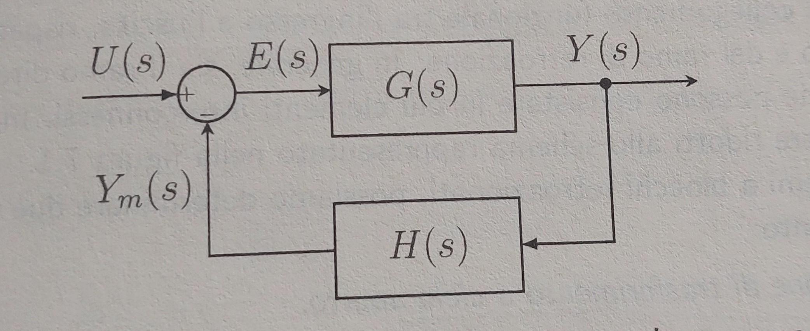
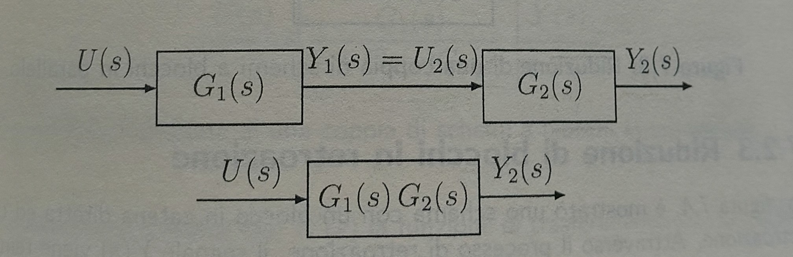
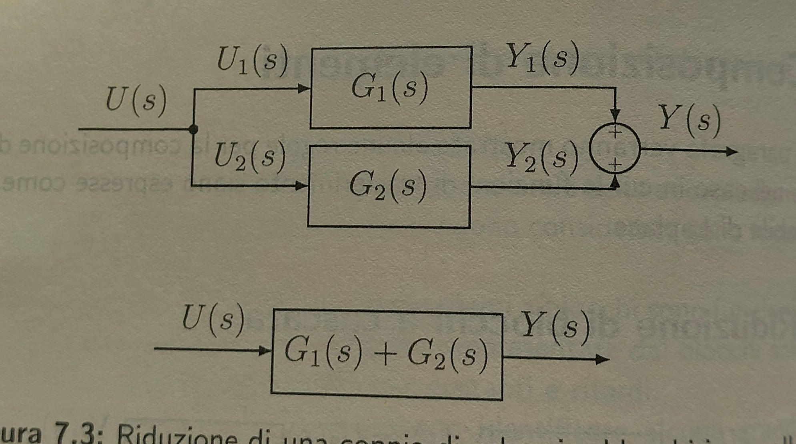
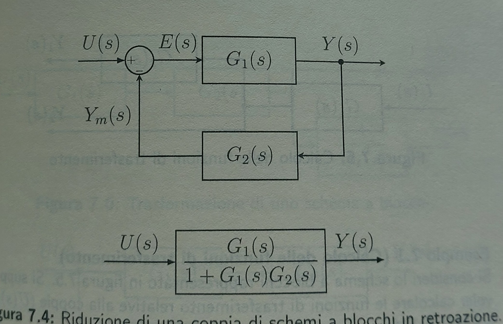

# BLOCK REPRESENTATION

## What is block representation
One useful way to represent system is the block representation such this one:

A block diagram presents the following element:
- Blocks that represent the mathematical bond or the transfer function between input and output, bond that can be a costant, an operation, a math equation, or even  integral and differential (in which case we speak of dynamic system);
- Branches that represent the input and output variable;
- Sum or comparator nodes, in which the output is obtained by summing or subtracting the input brenches;
- Branch nodes that allows to transfer output and input on more brenches.

In the exemple U(s) is an input (the one choosen by the engineer), Ym(S) an input of measure that is compared via the cum node with U(s), the result of this is E(S) that now become an input of G(s) that is the transfer function wich will produce with the input an output Y(s), Y(s) will be a visible result but became also an input for H(s) that will produce Ym(s).

## Elements composition

Cascading blocks:

we want to calculate Y2(s), we now that Y2(s) = G2(s) * U2(s), but U2(s) = Y1(s) = G1(s) * U(s), so.

Y2(s) = G2(s) * G1(s) * U(s) ---> Y2(s)/U(s) = G2(s) * G1(s)

Parallel blocks:

Y(s) = Y1(s) + Y2(s) = U1(s) * G1(s) + U2(s) * G2(s) where U1(s) = U2(s) so:

Y(s) = (G1(s) + G2(s))U(s) ---> Y(s)/U(s) = G1(s) + G2(s)

Feedback blocks:

Y(s) = G1(s) * E(s) = G1(s) * (U(s) + Ym(s)) = G1(s) * (U(s) + G2(s) * Y(s))

Y(s) = G1(s) * U(s) + G1(s) * G2(s) * Y(s) ---> Y(s)(1 - G1(s) * G2(s)) = G1(s) * U(s)

Y(s)/U(s) = G1(s)/(1 - G1(s) * G2(s))

  