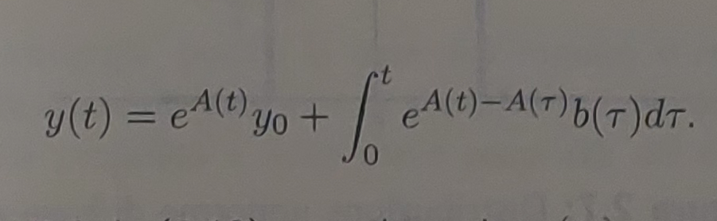

# Differential Equation could be fun

## DEFINITION
First let's define what is an integral. 
Let y = f(t) be a function and (t0, tb) an interval, our goal is to calculate the area defined by the curve y in the intervaal (t0, tb). 
A strategy to do that consist in dividing the interval in n equal parts called dt, each dt will represent the base of a rectangle, and the height of the rectangle will be the value of f(t) in dt(n-1). 
Doing this we've aproximated the area below the curve as a sum of areas (the rectangle's area).
This is the series that define the concept:

    
    

Now what if we increase the n portion, and if we do it again, and again... What if we increase it until it tends to infinite? In math terms this means applying limit to series.
Now we have our definition of integral (there are many): 

Another definition could be: the integral of a function f(t) is that class of function g(t) so that g'(t) = f(t)
Once we know that, if we want to know the value of an integral of a function f(t) in (t0, tb), if we know g(t) the calculation is pretty easy: g(tb)-g(t0).

The dimostration is pretty easy and consist in applying the integral to f(t)=d(g(t))/dt

From this last concept is clear how solving an integral is basically solving an equation that contains derivatives (ex. g'(t) = f(t)).
This kind of equation are differential equations.
There are a lot of differential equation but we will deal only with ODE (ordinary differential equation) and LDE (linearly differential equation).

## ODE VS LDE
In general, an ODE is an equation where the unknown is a function, and the terms are the derivatives of that function:
F(t,y(t),y′(t),…,y(n)(t))=0
We refer to an LDE when we can apply the principle of superposition of causes to the ODE. This means the equation can be written as:
y(k)+ak−1(t)y(k−1)+⋯+a0(t)y=g(t)

where the coefficients a0(t),…,ak−1(t) are the coefficients of the equation, g(t) is the known term, and y(t) is the unknown function.
It can happen that: the coefficients are constants (constant coefficients), g(t)=0 (homogeneous equation), and the parameters do not depend on time (autonomous case).

## Differential equation of the first order
The general form of a differential equation of the first order is the following:
y' = a(t)y + b(t)

if b(t) is zero the equation is omogeneous and can be solved with the method of separation of variables, let's see a simple exemple:
dy/dt = t*y
we can rearrange the terms
dy/y = t * dt
integrating each side and solving integrals
ln(y) = x^2 ---> e^ln(y) = e^(x^2) ---> y = e^(x^2)

else the equation is non-omogeneous. In this case, b(t) (in an automation or control context) is called the forcing term, since it represents the input applied to the system in order to achieve a certain goal. The solution is more complex:

Once solved the relative cauchy problem we arrive to:

The first term is called the free evolution, which represents the natural behavior of the system without any external intervention. (Notice that this part corresponds to the solution of the homogeneous equation where b(t)=0). The second term is called the forced evolution, which represents the behavior of the system after our interaction with it (through our input u(t)).
Notice that if a(t) is a costant than A(t) = a(t-t0) and the resulting function is: 

Where the last part indicates a convolution that result particulary important when done with the Dirac's delta.

## Differential equation with order superior to the first and costant coefficient
The most general formulation of this equation is the following:
y(k)(t) + ak-1y(k-1)(t) +...+ a0y(t)=g(t)
Even in this case, if g(t)=0, the equation is homogeneous. One of the key ideas to solve this kind of equation involves the characteristic polynomial.
In practice, we substitute each derivative of y with a power of an unknown λ:
y(k) = λ^k
By applying this substitution and keeping the coefficients, we obtain a polynomial. The roots of this polynomial can then be calculated, and these roots are used to reconstruct the solution of the original differential equation.
Now we have few possible cases.
CASE 1 - simple roots
We have k different roots all real, in this case the solution is simple:

CASE 2 - roots with double molteplicity and more 
We  have less than k different roots because some of them are double.
in this case the solution must follow the previous rule except for the fact that the root repeated must be multiplied with a polyomial that has a grade inferior by 1 of the mutiplicity of that root. Exemple:

this case can be easly generalized for the case where there is roots with multiplicity greater than 2.

CASE 3 - complex roots and coniugate
if we have two complex roots that are also coniugate the idea is pretty straight forward: we use the first solution considering that instead of real roots we have complex number. Then we ask how should c1 and c2 be? we will eventually find out that c1 and and c2 must also be complex coniugate, once found that we can return to our initial solution and simplify that considering this last thing. This will be the result: 

Once we have seen all this cases we have done the most of the work because this result will be useful also for the non-omogeneous equation. For the non omogeneous equation a solution can be found via the combination of a particular solution to the equation and the solution to the omogeneous associated equation:
Y(t) = yO(t) + yP(t)
