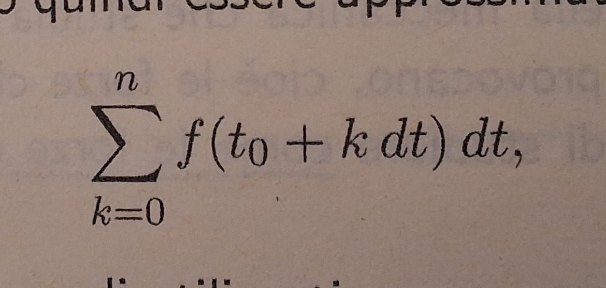
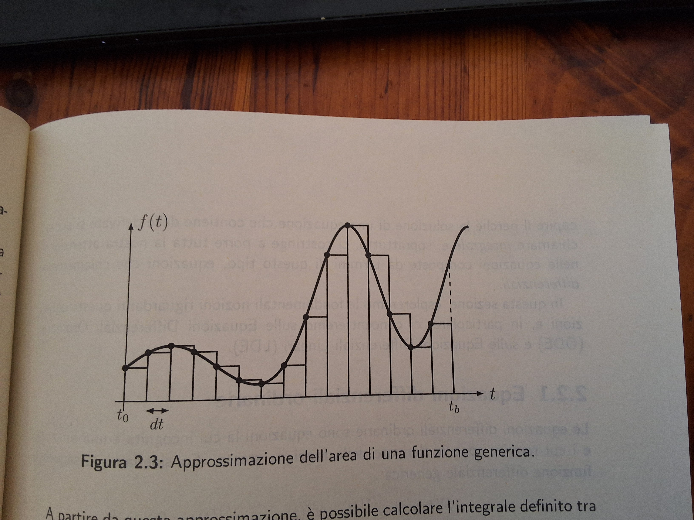
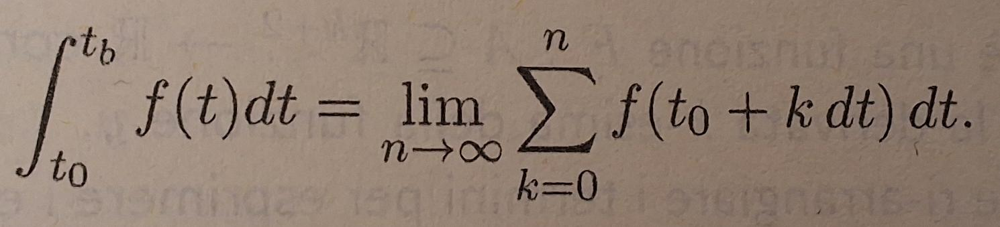
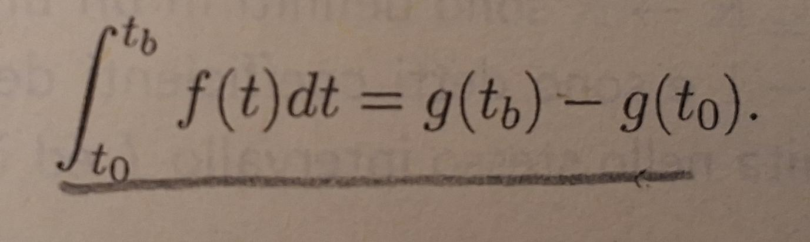
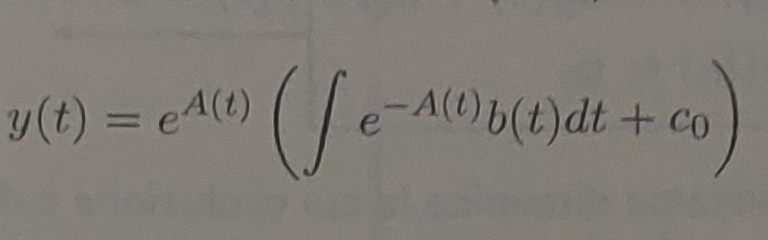
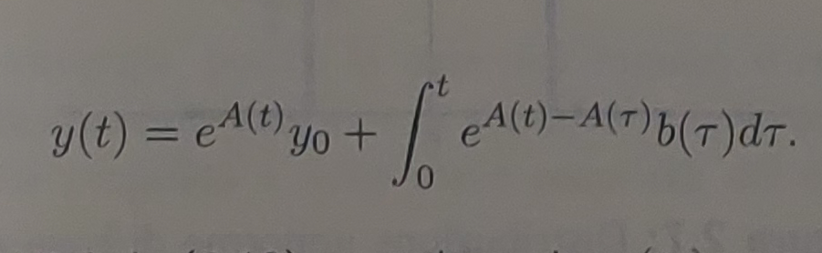

# Differential Equation could be fun

## DEFINITION
### First let's define what is an integral. 
### Let y = f(t) be a function and (t0, tb) an interval, our goal is to calculate the area defined by the curve y in the intervaal (t0, tb). 
### A strategy to do that consist in dividing the interval in n equal parts called dt, each dt will represent the base of a rectangle, and the height of the rectangle will be the value of f(t) in dt(n-1). 
### Doing this we've aproximated the area below the curve as a sum of areas (the rectangle's area).
### This is the series that define the concept:

### Now what if we increase the n portion, and if we do it again, and again... What if we increase it until it tends to infinite? In math terms this means applying limit to series.
### Now we have our definition of integral (there are many): 

### Another definition could be: the integral of a function f(t) is that class of function g(t) so that g'(t) = f(t)
### Once we know that, if we want to know the value of an integral of a function f(t) in (t0, tb), if we know g(t) the calculation is pretty easy: g(tb)-g(t0).

### The dimostration is pretty easy and consist in applying the integral to f(t)=d(g(t))/dt

### From this last concept is clear how solving an integral is basically solving an equation that contains derivatives (ex. g'(t) = f(t)).
### This kind of equation are differential equations.
### There are a lot of differential equation but we will deal only with ODE (ordinary differential equation) and LDE (linearly differential equation).

## ODE VS LDE
### In general, an ODE is an equation where the unknown is a function, and the terms are the derivatives of that function:
### F(t,y(t),y′(t),…,y(n)(t))=0
### We refer to an LDE when we can apply the principle of superposition of causes to the ODE. This means the equation can be written as:
### y(k)+ak−1(t)y(k−1)+⋯+a0(t)y=g(t)

### where the coefficients a0(t),…,ak−1(t) are the coefficients of the equation, g(t) is the known term, and y(t) is the unknown function.
### It can happen that: the coefficients are constants (constant coefficients), g(t)=0 (homogeneous equation), and the parameters do not depend on time (autonomous case).

## Differential equation of the first order
### The general form of a differential equation of the first order is the following:
### y' = a(t)y + b(t)
### 
### if b(t) is zero the equation is omogeneous and can be solved with the method of separation of variables, let's see a simple exemple:
### dy/dt = t*y
### we can rearrange the terms
### dy/y = t * dt
### integrating each side and solving integrals
### ln(y) = x^2 ---> e^ln(y) = e^(x^2) ---> y = e^(x^2)
###
### else the equation is non-omogeneous. In this case, b(t) (in an automation or control context) is called the forcing term, since it represents the input applied to the system in order to achieve a certain goal. The solution is more complex:

### Once solved the relative cauchy problem we arrive to:

