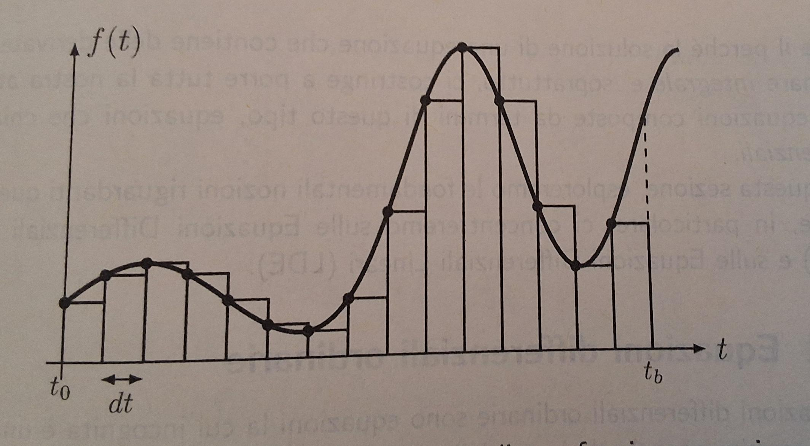

# Differential Equation could be fun

## DEFINITION
### First let's define what is an integral. 
### Imagine to calculate the area underlying a function y = f(t) in (t0, tb). To do that we can devide (t0, tb) in pieces equal to dt, for each piece we can calculate the area taking the value of dt (that represent the base of the rectangle under the curve) and multiplying that by the value assumed by the function in the lower extreme:

