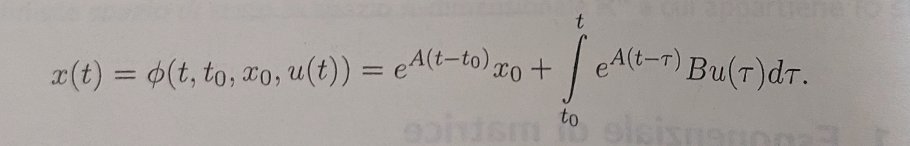
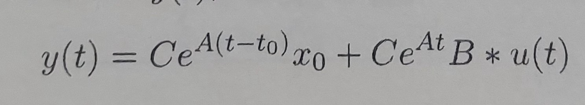

# MODAL TRANSFORMATION OF DIFFERENTIAL EQUATION

## General Matrix Representation
Let's assume we have two system of equation:

1
ẋ1 = a1,1*x1 + ... + a1,n*xn + b1,1*u1 + b1,p*up 
.
.
.
ẋn = an,1*x1 + ... + an,n*xn + bn,1*u1 + ... + bn,p*up

y1 = c1,1*x1 + ... + c1,n*xn + d1,1*u1 + d1,p*up 
.
.
.
yn = cn,1*x1 + ... + cn,n*xn + dn,1*u1 + ... + dn,p*up

this two system can be written like this:

ẋ = Ax + Bu
y = Cx + Du

where:
u is the vector of input;
y is the vector of the output;
x is the vector of the state of the system;
A is the dynamic matrix of the system;
B is the input matrix;
C is the output matrix;
D is the matrix that represent the bond between input and output.
This representation is called input-state-output.

## Companion Form
The companion form is a particular form of the system where we end up in a system lie this:

ẋ = Ax + Bu
y = Cx

to achive this form we start from a generic linear differential equation:
y(k)(t) + ... + a0*y(t) = u

y(k) means derivated k times.
starting from this we will set:
x1 = y(t)
.
.
.
xk = y(k-1)(t)
so derivating each xi we obtain:
ẋ = x1
.
.
.
ẋk = y(k)(t) = - ak-1 * xk-1 + ... + -a0*x1 + u

so the resulting system will be 
ẋ = Ax + Bu
y = Cx 

where A will be called companion structure and will be something like:

0 1 0 .... 0
0 0 1 0 .. 0
...
0  ....  0 1
-a0 .. -ak-1

where BT will be somthing like:

0 0 ... 1
and CT will be:
1 0 ... 0

Before going on there is an important puntualization that will be useful later in this argument. 
The particularity of the state matrix of the system of equations obtained through this procedure is that its characteristic polynomial, derived by imposing det(A-λI) = 0 is equivalent to the characteristic polynomial of the original differential equation.
In fact, this is always true.

Now if we want to resolve this we will find out a solution for x like this:

Now to solve the system we need to substitute the solution to y(t) equation. remembering that the forcing term an be written as a convolution the result is:

Notice that there is an e^A where A is a matrix, so what means to  elavate to a matrix? one possible interpretation of this is remembering what is one of the possible definition of e^at:

e^at = 1 + at + a^2*t^2/2! ... = sum((at)^i/i!) for i from 0 to infinity
so substituting A we obtain: e^At = sum((At)^i/i!).

the derivate of e^At can be obtain by deriving each argument of the series before described and summing them up, the result will be: (e^At)' = A*e^At.

and the inverse of e^At will be e^-At if and oly if A2*A1 = A1*A2 that allows us to use the property e^A1*e^A2 = e^(A1 + A2).

## Change of coordinates
Once we have set the system relative to the differential equation with this particular method we can ask "there is a way to see the problem from another perspective?"
the answer to this is obviously yes. The key idea to do that is too choose a new matrix T (that help us to transform the system) and a new set of coordinates z (state vector).

x = Tz

now we can substitute the x in the system resulting in:

Tż = ATz + Bu --> (T^-1*T)ż = T^-1*ATz + T^-1*Bu --> ż = T^-1*ATz + T^-1*Bu
y = CTz --------> \\\ -----------------------------> \\

now we can call T^-1*AT = Ã, T^-1*B = B̃ and CT = C̃

ż = Ãz + B̃u
y = C̃z

Notice also how the change, if made properly doesn't change the nature of the system, infact we can calculate the det(Ã - λI) = 0:
det(T^-1*AT - λT^-1*I*T ) = det(t^-1*(A-λI)*T) = det(t^-1) * det(A-λI) * det(T) = det(A-λI) 
that will guarantee that the characteristic polynomial will be the same.

This change can help us to see the problem in a different way for a better comprehension of it.

## Modal tansposition and exp calculation
But how to choose a T matrix? One particolar choice can be the matrix composed by the eigenvectors of the status matrix (let's suppose that the eigenvectors are linearly indipendent).

T = [v1 v2 ... vn]

T^-1 exists because  det(T) is different from zero.

Now if we multiply A with T this means that we are multpling the matrix A with her eigenvector which means, for the definitions of eigenvectors, that the result will be the matrix of eigenvectors multiplied by the relative eigenvalue so:
AT = [λ1v1 ... λnvn] 
this can also be written as:
[vi ... vn] * λ1 0 0 ....
              ....
              0 0 ... 0 λn  

so AT = TΛ that can be A = TΛT^-1 we can use this result to calculate the value of e^At

remember that: e^At = sum((A*t)^i / i!) for i from 0 to infinity, that sum will change in: sum(( TΛT^-1 *t)^i / i!)

(TΛT^-1)^k = T Λ^k T^-1, so the sum will be T * sum(Λ^k*t^i/i!)  * T^-1

where the final result will be that e^Λt will give:

e^λ1t 0 0 0 0 ...
....
0 ....... 0 e^λnt 

If we want a stable solution we should find all λi negative.

what happens if instead the eigenvectors are complex coniugate? Well in this case we can still wrote the solution in a useful way to see the oscillatory nature of the system.
let's say that λ and λ* are the eigenvalue and v v* are the eigenvectors we will define x and y as the real and the imaginary part of v as follow:
x = (v+v*)/2  ,  y = (v-v*)/2j 
now we construct T = [re[v] im[v]] = [x y]

T^-1*AT = Ã so we ca also write TÃ = AT = A[re[v] im[v]] = [ (Av + Av*)/2  (Av - Av*)/2 ] =  [(λ*v + λ*v*)/2  (λ*v - λ*v*)/2] = [re(λv)  im(λv)]

now if λ = σ + jw we can see that re[λ*v] = re[σv + jwv] = σre[v] - w*im[v]
analogus for im that will give im[λ*v] = σim[v] + w*re[v]

so AT can be rewritten as [re[v] + im[v]] *  [σ  w; -w  σ] = T*Ã
                                            
now to calculate e^Ãt we can consider à = the sum of this matrix:

σ 0   +   0 w
0 σ   +  -w 0

e^Ãt = e^A1 * e^A2, for the first term is easy given the previous result, for the second we can still use the taylor expantion noticing that the result, cause the expantion of cosine and sine can be written as:
cos(wt)   sin(wt)
-sin(wt)  cos(wt)

the final result will be that e^Ãt is also equal to:

e^σt*cos(wt)   e^σt*sin(wt)
-e^σt*sin(wt)  e^σt*cos(wt)

once we now that e^At is T*e^Ãt*T^-1 :

e^σt * T * e^A2 * t^-1

THIS IS A LOT OF STUFF AND PROBABLY NOT EXPLAINED VERY WELL, but it gives you an idea of what's going on.
maybe later i will introduce some exemple.